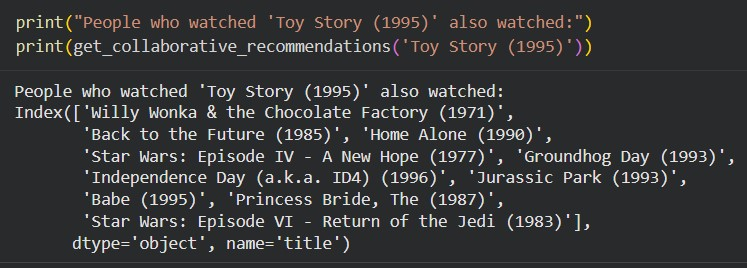

# Hybrid Recommender System

## 📌 Overview
This recommender system designed to provide highly accurate user recommendations by combining two distinct machine learning approaches. 

The primary engineering goal of this project was to architect a system capable of bypassing the "Cold Start" problem, which is a common critical failure point in pure collaborative filtering systems where new users or unrated items cannot be processed.

<a href="[Colab](https://colab.research.google.com/drive/1z5QmOepAAq3pa61FP4Bl4mJtmCc6x8SX?usp=sharing)" target="_parent"></a>



## 🏗️ System Architecture

The engine balances two systems:
1. **Content-Based Filtering (NLP):** Utilizes **TF-IDF (Term Frequency-Inverse Document Frequency)** vectorization combined with Cosine Similarity to recommend items based on metadata and text descriptions. This ensures new, unrated items still reach the correct audience.
2. **Collaborative Filtering (Matrix Factorization):** Leverages **Singular Value Decomposition (SVD)** to uncover latent user preferences and hidden item relationships based on historical interaction matrices.

### The Hybrid Logic:
When a user has sufficient interaction history, the system weights the Collaborative (SVD) model heavily. For brand-new users (Cold Start), the system falls back entirely on the Content-Based (TF-IDF) model to provide immediate, relevant suggestions based on initial selections.

## 🚀 How to Run Locally

1. **Clone the repository**
   ```bash
   git clone [https://github.com/yourusername/hybrid-recommender-system.git](https://github.com/helixneek/hybrid-recommender-system.git)
   cd hybrid-recommender-system

2. **Set up the environment**
    ```bash
    python -m venv venv
    source venv/bin/activate  # On Windows use `venv\Scripts\activate`
    pip install -r requirements.txt

3. **Run the notebook**
    ```bash
    jupyter notebook notebooks/recommender_pipeline.ipynb

## 📈 Future Optimizations

1. Migrate the static SVD model to a Neural Collaborative Filtering (NCF) architecture using PyTorch.

2. Implement a vector database (e.g., FAISS) to speed up the Cosine Similarity search from O(N) to O(logN) for production-scale item catalogs.


